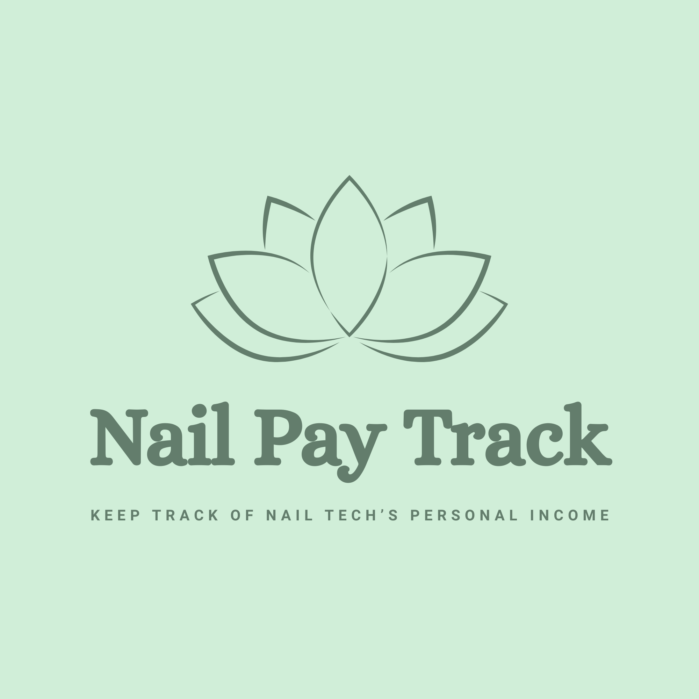
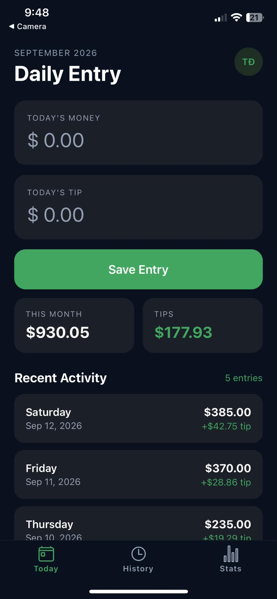
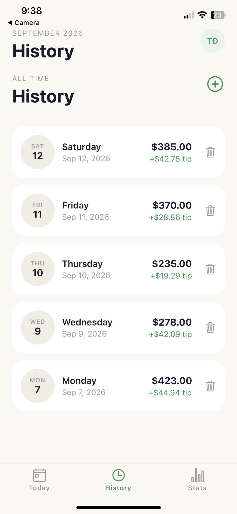
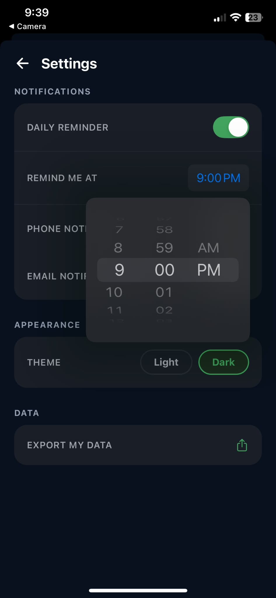
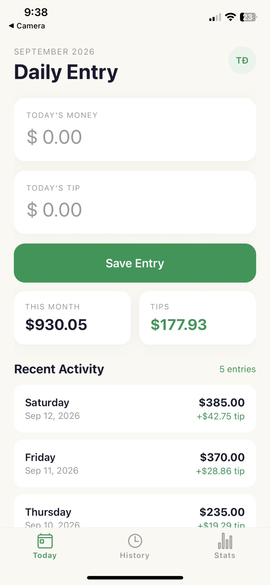

# Nail Pay Track

**Keep track of nail tech's personal income**

A simple, private, offline-first mobile app that helps nail techs log their daily earnings, understand their real take-home pay, and know exactly which tips have and haven't been paid out.

---

## Why I Built This

My girlfriend is a nail tech, and her salon has no tool to track employees' pay — no app, no shared spreadsheet, nothing. I originally built her a Google Sheet to log her daily money and tips and auto-calculate her monthly totals. It worked, but it lived on a computer and wasn't something she (or any other nail tech) could carry around and update in thirty seconds between clients.

This app is that same idea, rebuilt from scratch as a real mobile app — designed to be fast enough to update at the front desk, and honest enough to catch a paycheck discrepancy before it slips by.

## Features

- **Log daily earnings**: enter today's money and tips in a few taps
- **Full history**: every day you've logged, editable and deletable
- **Add a past entry**: forgot to log yesterday? Add any past date, blocked from duplicating a day you've already logged
- **Real wage math**: your take-home pay is calculated as `(money × your salon split %) + tips`, not just the raw total
- **Tip reconciliation**: salons often pay out cash tips twice a month (15th and last day of month). The app automatically tracks which tips have been **Received** vs. are still **Unpaid**, based on those payout dates
- **Salon profile**: save salon's name, address, and commission split
- **Local daily reminder**: an on-device push notification so you never forget to log a day
- **Data export**: share a full JSON export of your entries anytime, so you always have a backup
- **Dark mode**: full light/dark theme support throughout
- **Fully private**: everything is stored locally on your device. No account, no server, no ads, nothing leaves your phone

## Screenshots

<table>
<tr>
<td align="center" width="33%">
 
Today entry (dark mode)
</td>
<td align="center" width="33%">
 
History — tap any day to edit
</td>
<td align="center" width="33%">
 
Settings — light/dark theme
</td>
</tr>
</table>

 
Today entry (light mode)

## How to Get This App
 
This app isn't on the App Store yet, so getting it on your phone takes a few extra steps the first time.
 
### Step 1: Install "Expo Go" from App Store
 
1. Open **App Store** on iPhone
2. Search "**Expo Go**" and finish free installation

### Step 2: Create a free Expo account
 
1. Open the **Expo Go** app you just installed
2. Tap **Sign Up** (not "Log In," since you don't have an account yet)
3. Enter your email address and create a password
4. Check your email for a confirmation message from Expo and follow to confirm your account
5. Once confirmed, go back to the Expo Go app and log in

### Step 3: Fill out this quick form
 
So I can invite you to use the app, I need your name and the **same email address** you just used to sign up for Expo. Please fill out this short form:
 
👉 **[Google Form link](https://www.linkedin.com/in/2dt)**
 
### Step 4: Wait for your invite email
 
Once I receive your submission, I'll send you an invitation by email to join the project. This usually only takes me a day or so. Look out for an email from **Expo** with an invitation link, and tap **Accept**.
 
_(If you don't see it, check your spam/junk folder.)_
 
### Step 5: Open the app
 
1. Once you've accepted the invite, I'll send you a link and a QR code to open the app
    - If receive a **link**: tap it on iPhone, and it should open automatically inside Expo Go
    - If receive a **QR code**: open the Expo Go app, tap **Scan QR Code**, and point your camera at the code
2. The app should load — the first time might take a minute, that's normal

## Tech Stack

### Frontend

- [React Native](https://reactnative.dev/) + [Expo](https://expo.dev/) (SDK 57)
- [TypeScript](https://www.typescriptlang.org/)
- [React Navigation](https://reactnavigation.org/) (bottom tabs + native stack, incl. modal presentation)
- [Zustand](https://github.com/pmndrs/zustand) for state management

### Database

- [expo-sqlite](https://docs.expo.dev/versions/latest/sdk/sqlite/) — local, on-device database (entries, profile, salon, settings)
- `expo-file-system` — persisting profile photos on-device

### Tooling & Distribution
- [EAS (Expo Application Services)](https://expo.dev/eas) — builds and updates
- Expo Go — development/preview distribution

### Backend _(planned)_
- [Go](https://go.dev/) — for future cloud sync/backup, once there's validated user demand
